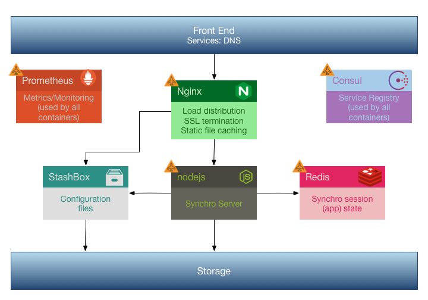

# Synchro AutoPilot

This project is an implementation of the AutoPilot Pattern using ContainerPilot in support of the Synchro Server application.

This project includes the container definition and support files for custom Nginx, Synchro, and Redis deployments that are self-orchestrating using ContainerPilot.  For more information on the AutoPilot Pattern using ContainerPilot, see: https://www.joyent.com/containerpilot

The project also contains Docker compositions for running those containers, along with the other containers that they require, either locally or on Joyent Triton.

The beauty of self-orchestrating containers is that they can be run from any orchestration solution without need to take any special action other than to run the number of each type of container that is needed.  In this applicaton, new instances of nginx will find the set of Synchro servers to route to, and when Synchro instances appear or dissapear, all nginx servers will automatically update, without your app orchestration system needing to be involved at all.

While this project contains container definitions and support files, that would allow you to build your own images if desired, it should be noted that Synchro can be deployed using only the published containers from the Docker registry (as referenced from the docker-compose.yml file).  Those images are:

    synchro/synchro_ap
    synchro/synchro_nginx_ap
    synchro/synchro_redis_ap

This project also uses StashBox.  For more information on configuring/using StashBox, see: https://github.com/SynchroLabs/StashBox

## Deploying Locally

To deploy the Synchro AutoPilot solution locally, simply do:

    docker-compose up

The Synchro API server will be available (via Nginx) at http://localhost:8080

## Deploying on Triton

To deploy on Joyent Triton, first ensure that you have installed and configured the Triton CLI, then do:

    make runtriton

This will run setup.sh (if necessary) to set up your Joyent environment vars for use by Docker, and will then deploy the solution to Triton.  The Synchro API server will be available at http://synchro.svc.${TRITON_ACCOUNT}.${TRITON_DC}.triton.zone
